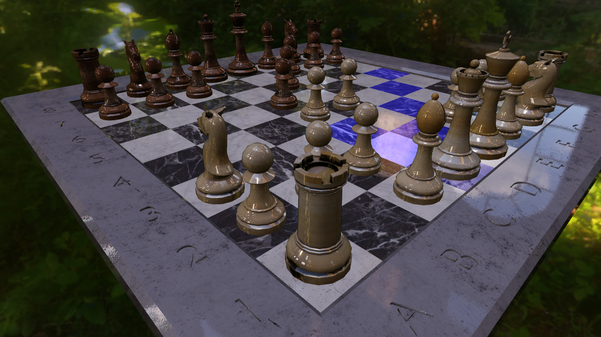

# Vulkan stockfish client.



credits for the 3d chess pieces to (Matt Joos)[https://sketchfab.com/mathiasjoos]

### Requirements:

- [stockfish](https://stockfishchess.org/)
- [Vulkan](https://www.khronos.org/vulkan/)
- [FontConfig](https://www.freedesktop.org/wiki/Software/fontconfig/)
- [Freetype](https://www.freetype.org/)
- PkgConfig
- [Harfbuzz](https://www.freedesktop.org/wiki/Software/HarfBuzz/)
- GLSLC: spirv compiler, included in [LunarG SDK](https://www.lunarg.com/vulkan-sdk/) (building only)
- CMake

### Building

```bash
git clone https://github.com/jpbruyere/vkChess.git     # Download source code from github
cd vkChess                                             # Enter the source directory
git submodule update --init --recursive                # download submodules
mkdir build                                            # Create build directory
cd build
cmake ..                                               # Run CMake, optionaly setup glslc path
make                                                   # Run Make

### Known bugs

- PAD ending is not detected.
- black/white selection has to be done in code as well as player/ai selection.
```
### hot keys

- u : undo
- h : toggle hints
- r : restart with white
